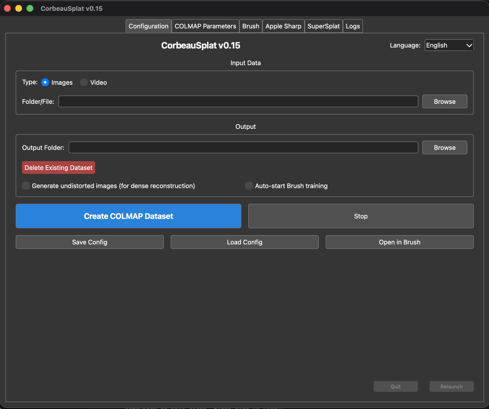

# CorbeauSplat

**CorbeauSplat** is an all-in-one Gaussian Splatting automation tool designed specifically for **macOS Silicon** . It streamlines the entire workflow from raw video/images to a fully trained and viewable 3D scene (Gaussian Splat).



## 🚀 What it does

This application provides a unified Graphical User Interface (GUI) to orchestrate the following steps:
1.  **Data Preparation**: Extracts frames from videos using hardware-accelerated FFmpeg.
2.  **Sparse Reconstruction**: Automates **COLMAP** feature extraction, matching, and mapping to create a sparse point cloud and camera poses.
3.  **Undistortion**: Automatically undistorts images for optimal training quality.
4.  **Training**: Integrates **Brush** to train Gaussian Splats directly on your Mac.
5.  **Visualization**: Includes a built-in tab running **SuperSplat** for immediate local viewing and editing of your PLY files.

It is designed to be "click-and-run", handling dependency checks and process management for you.

## ✍️ A Note from the Author

> This program was realized through **"vibecoding"** with the help of **Gemini 3 Pro**.
>
> It was originally created to facilitate the technical workflow for a documentary film titled **"Le Corbeau"**. I am not a professional developer; I simply needed to automate a complex process by gathering the tools I use daily: COLMAP, the Brush app, and SuperSplat. 
>
> I share this code in all humility. I didn't originally plan to release it, but I thought that perhaps someone, somewhere on this earth, might find it useful.
>
> As this software was built via "vibecoding" (AI-assisted coding), it is provided "as is" with no guarantees.

## 🛠 Prerequisites & Installation

### Requirements
- **macOS** (Silicon recommended)
- **Homebrew** (for installing system dependencies like COLMAP and FFmpeg)
- **Git**

### Installation
1.  Clone this repository:
    ```bash
    git clone https://github.com/your-username/CorbeauSplat.git
    cd CorbeauSplat
    ```

2.  Run the launcher:
    ```bash
    ./run.command
    ```
    *The script will automatically detect missing dependencies (Python packages, Brush, SuperSplat) and attempt to install them for you.*

## 📖 How to Use

1.  **Configuration Tab**: 
    - Select your input (Video or Folder of images).
    - Choose an output folder.
    - Click **"Create COLMAP Dataset"**.
2.  **Params Tab**: (Optional) Tweak advanced COLMAP settings if needed. The defaults are optimized for Apple Silicon.
3.  **Brush Tab**: 
    - Once COLMAP finishes, you can start training directly.
    - Click **"Start Brush Training"**.
4.  **SuperSplat Tab**: 
    - Load your trained `.ply` file.
    - Click **"Start Servers"** to launch the viewer locally.

### Command Line Interface (CLI)

CorbeauSplat exposes all its features via the command line, making it easy to integrate into automated pipelines or run on headless machines.

#### 🚀 Quick Usage

**1. Create a COLMAP Dataset**
This runs the full pipeline: video frame extraction -> feature extraction -> matching -> sparse reconstruction -> undistortion.

```bash
# From Video
python3 main.py --input /path/to/video.mp4 --output /path/to/project_folder --type video

# From Images folder
python3 main.py --input /path/to/images --output /path/to/project_folder --type images
```

**2. Train a Splat (Brush)**
Train a Gaussian Splatting model using the dataset created in step 1.

```bash
python3 main.py --train --input /path/to/project_folder --output /path/to/output_model --iterations 30000
```
*Note: `--input` must be the directory containing the 'images' and 'sparse' folders.*

**3. Visualise (SuperSplat)**
Launch a local web viewer for your trained `.ply` file.

```bash
python3 main.py --view --input /path/to/output_model/splat.ply
```

**4. Single Image to 3D (ML-Sharp)**
Use Apple's machine learning model to generate a splat from a single photo.

```bash
python3 main.py --predict --input photo.jpg --output /path/to/output_dir
```

#### ⚙️ Advanced Options

**General**
| Flag | Description |
| :--- | :--- |
| `--gui` | Force launch the Graphical Interface (default if no args are passed). |
| `--help` | Show the full help message with all available flags. |

**COLMAP Options**
| Flag | Description |
| :--- | :--- |
| `--fps <int>` | Frames per second for video extraction (Default: 5). |
| `--camera_model <str>` | COLMAP camera model (SIMPLE_RADIAL, PINHOLE, etc.). |
| `--undistort` | Add this flag to run image undistortion after reconstruction. |

**Brush Options**
| Flag | Description |
| :--- | :--- |
| `--iterations <int>` | Training steps (Default: 30000). |
| `--sh_degree <int>` | Spherical Harmonics degree (Default: 3). |
| `--device <str>` | Force device (e.g., `mps`, `cpu`). Default: `auto`. |

**SuperSplat Options**
| Flag | Description |
| :--- | :--- |
| `--port <int>` | Web server port (Default: 3000). |
| `--data_port <int>` | Data server port (Default: 8000). |

## 👏 Acknowledgments & Credits

This project stands on the shoulders of giants. A huge thank you to the creators of the core technologies used here:

*   **COLMAP**: Structure-from-Motion and Multi-View Stereo. [GitHub](https://github.com/colmap/colmap)
*   **Brush**: An efficient Gaussian Splatting trainer for macOS. [GitHub](https://github.com/ArthurBrussee/brush)
*   **SuperSplat**: An amazing web-based Splat editor by PlayCanvas. [GitHub](https://github.com/playcanvas/supersplat)

## 📄 License

This project is licensed under the **MIT License** - see the [LICENSE](LICENSE) file for details. This is the most permissive open-source license, allowing you to use, modify, and distribute this software freely.
